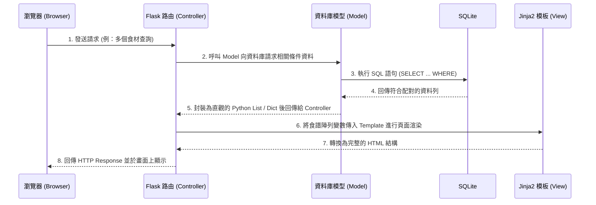

# 系統架構文件 (Architecture)：食譜收藏夾系統

## 1. 技術架構說明

本專案採用經典的 Python 後端框架搭配前端模板渲染技術，不進行前後端分離（Server-Side Rendering），以常見的 MVC（Model-View-Controller）設計模式為核心。這種做法有助於降低初期開發與部署的複雜度，非常適合快速打造並驗證最小可行性產品（MVP）。

### 選用技術與原因
- **後端核心：Python + Flask**
  - **原因**：Flask 是輕量化、自由度極高的微框架，學習曲線平緩，很適合快速架設網站邏輯與 API 介面。
- **網頁模板：Jinja2**
  - **原因**：Jinja2 是 Flask 內建的強大模板引擎，可以無縫將後端 Python 變數動態渲染到 HTML 中，並且支援「模板繼承（Template Inheritance）」機制，幫助我們建立共用的版面。
- **資料庫：SQLite**
  - **原因**：使用不需繁瑣建置伺服器的輕量資料庫引擎，利用單一檔案形式即可讀寫資料，大幅節省初期開發的時間成本與配置麻煩。

### Flask MVC 模式說明
我們將參考 MVC 的概念將專案的職責進行切分：
- **Model（模型 / 資料庫操作層）**：負責與 SQLite 內部的 `Users` 與 `Recipes` 資料表溝通。任何資料的查詢、新增、修改、刪除都集中在這一層處理。
- **View（視圖 / 介面層）**：由 HTML、CSS 與 Jinja2 所構成的 `templates/` 目錄內容。將 Controller 傳過來的資料呈現給使用者。
- **Controller（控制器 / 路由決策層）**：由 Flask 的路由函式（Route）擔任。負責讀取瀏覽器的 Request 請求，並向 Model 調度資料，然後傳送給 View 去渲染頁面。

---

## 2. 專案資料夾結構

以下為本專案建議的核心資料夾結構，以模組化方式配置檔案，使專案易於維護擴充：

```text
web_app_development/
├── app/                  # 應用程式主要功能與邏輯目錄
│   ├── models/           # [Model] 資料庫模型
│   │   ├── __init__.py
│   │   ├── user.py       # 使用者帳號與權限相關資料庫操作
│   │   └── recipe.py     # 食譜讀寫、關鍵字檢索、多重食材檢索操作
│   ├── routes/           # [Controller] 路由模組
│   │   ├── __init__.py
│   │   ├── auth.py       # 登入、註冊、登出等認證路由
│   │   ├── index.py      # 首頁及一般系統靜態頁面路由
│   │   └── recipe.py     # 處理食譜的 CRUD 與搜尋邏輯路由
│   ├── templates/        # [View] Jinja2 的網頁模板層
│   │   ├── base.html     # 共用母版 (包含 Navbar 等全域 UI)
│   │   ├── index.html    # 首頁畫面
│   │   ├── auth/         # 認證用的 HTML 畫面配置
│   │   └── recipe/       # 食譜詳細頁、搜尋結果與表單頁面
│   └── static/           # 前端運作所依賴的靜態資源
│       ├── css/
│       │   └── style.css # 共用的網站樣式表
│       ├── js/           # 前端互動邏輯 (如: 新增食材輸入框)
│       └── images/       # 預設或靜態展示圖片
├── instance/             # 環境配置與運作資料
│   └── database.db       # SQLite 實體資料庫存檔位置
├── docs/                 # 開發文件存放區
│   ├── PRD.md            # 產品需求文件
│   └── ARCHITECTURE.md   # 系統架構設計文件 (本文件)
├── app.py                # 應用程式的主啟動進入點與初始化
└── requirements.txt      # 記錄相依 Python 套件清單
```

---

## 3. 元件關係圖

以下展示專案在執行諸如「瀏覽或查詢食譜」等請求時，系統內部處理流程的基本關聯。



---

## 4. 關鍵設計決策

以下列出影響本專案開發的重要系統設計方案：

1. **Flask Blueprints 職責分離機制**
   - **考量點**：如果將每個功能的路由都寫在同一個檔案內，未來維護會非常困難。
   - **決定**：使用 Blueprint 將路由拆分為 `auth` 與 `recipe` 等模組，把相關聯的功能（如食譜操作、認證邏輯）區隔開來，便於讓不同的工程師協作。
2. **雜湊儲存防護機制**
   - **考量點**：保護使用者密碼，確保即使資料庫被洩漏也不會造成明顯的安全危機。
   - **決定**：不使用明碼寫入密碼，利用 Werkzeug 的 `generate_password_hash` 和 `check_password_hash` 強制進行單向雜湊加密後才寫入 SQLite 中。
3. **Session 與身分權限控管**
   - **考量點**：判斷哪些使用者可以管理平台，哪些只能創建個人食譜。
   - **決定**：運用 Flask Session 在登入後紀錄該使用者的狀態 (User ID) 以及專屬的 "role" (角色如 `admin` 或 `user`)。在進階路由上增加檢查防護，確認權限正確後才放行。
4. **簡化的 SQL 關鍵字組合檢索**
   - **考量點**：「食材反向組合搜尋」如果建立多對多的龐大資料表架構，會需要額外的許多索引與建置時間。
   - **決定**：針對初期 MVP 階段，將主要用字串欄位儲存食材，以「建立 LIKE 語句結合 AND/OR 的組合邏輯」進行搜尋，來快速達成從冰庫剩下的食材列出可以對應出的食譜。未來有量級突破才進行全文檢索引擎重構。
5. **集中化的 Model 存取**
   - **考量點**：將存取 DB 的程式直接寫在路由中，容易發生重複程式。
   - **決定**：把 `sqlite3` 的查詢與執行抽離並集中封裝至 `models/` 目錄中。Controller 只負責呼叫對等的功能（如 `recipe.find_by_ingredients(list)`），而不知悉底層連線處理的細節。
