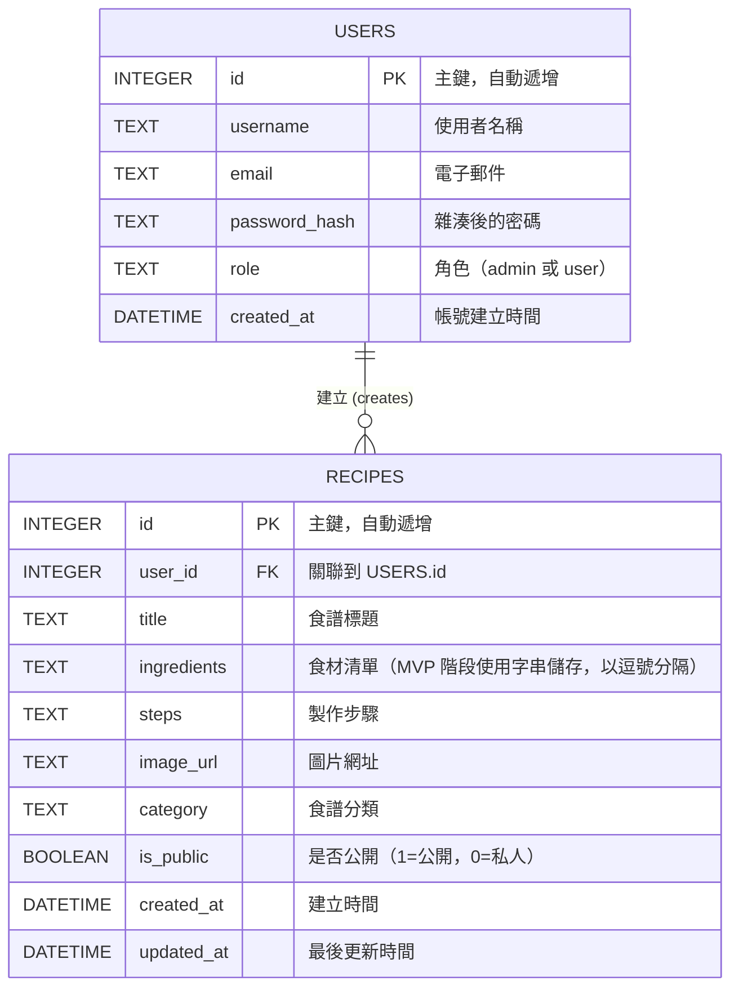

# 資料庫設計文件 (DB Design)：食譜收藏夾系統

本文件基於 PRD 與系統架構文件（MVP），定義 SQLite 資料表結構與關聯。

## 1. ER 圖（實體關係圖）

## 2. 資料表詳細說明

### `users` (使用者資料表)
儲存系統的使用者帳號與權限資訊。
- `id` (INTEGER): Primary Key，自動遞增。
- `username` (TEXT): 必填，使用者登入或顯示名稱。
- `email` (TEXT): 必填且唯一，使用者聯絡用電子信箱與登入帳號。
- `password_hash` (TEXT): 必填，不可儲存明碼，使用 `werkzeug.security` 產生的雜湊值。
- `role` (TEXT): 必填，預設為 `user`，可設定為 `admin` 供管理員使用。
- `created_at` (DATETIME): 必填，預設為當前時間。

### `recipes` (食譜資料表)
儲存使用者所建立的各項食譜內容。
- `id` (INTEGER): Primary Key，自動遞增。
- `user_id` (INTEGER): Foreign Key，對應 `users.id`，必填。代表建立此食譜的擁有者。
- `title` (TEXT): 必填，食譜標題。
- `ingredients` (TEXT): 必填，為了實作 MVP 的食材檢索功能，暫以逗號或其他特定分隔符號儲存多個食材字串。
- `steps` (TEXT): 必填，製作步驟（可儲存純文字或簡單的換行符號）。
- `image_url` (TEXT): 非必填，食譜完成圖的外部網址預覽。
- `category` (TEXT): 非必填，如：中式、便當、甜點等分類標籤。
- `is_public` (BOOLEAN): 必填，預設為 `1` (公開)。若為 `0` 則只有建立者自己可以看見與搜尋到。
- `created_at` (DATETIME): 必填，預設為當前時間。
- `updated_at` (DATETIME): 必填，預設為當前時間，更新時修改。
