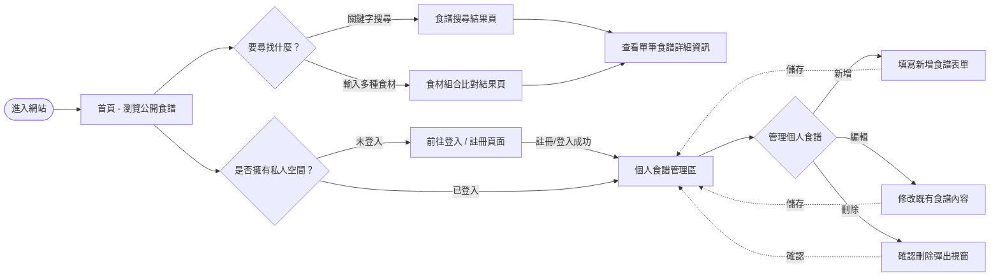
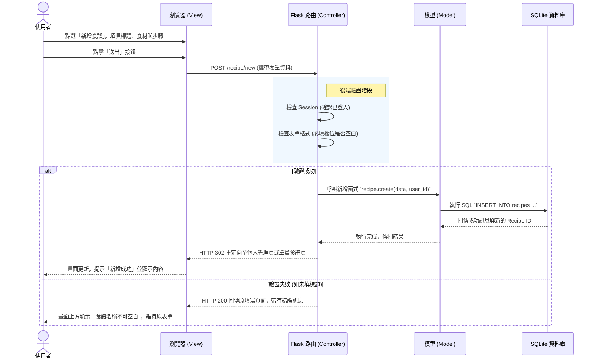

# 流程圖文件 (Flowchart)：食譜收藏夾系統

本文件根據 `docs/PRD.md` 與 `docs/ARCHITECTURE.md` 的規劃，視覺化使用者的操作路徑與後端系統的資料流，協助團隊確認各項功能的互動邏輯。

## 1. 使用者流程圖（User Flow）

呈現使用者進入網站後的操作動線，並根據是否登入區分不同功能權限。

## 2. 系統序列圖（System Sequence Diagram）

以核心功能「**新增食譜**」為例，說明從前端發送請求直到資料庫儲存並回傳結果的完整系統流轉過程。

## 3. 功能清單對照表

下表羅列了系統主要功能的 URL 路徑與對應的 HTTP 方法，供後續開發與路由設計作為基準：

| 功能模組 | 功能描述 | URL 路由路徑 (Route) | 支援 HTTP 方法 |
| :--- | :--- | :--- | :--- |
| **首頁與查詢** | 展示首頁（公開列表） | `/` | GET |
| | 一般關鍵字搜尋食譜 | `/search` | GET |
| | **透過現存食材反向搜尋** | `/combo-search` | GET |
| **會員機制** | 進入註冊與處理註冊送出 | `/auth/register` | GET, POST |
| | 進入登入與處理登入送出 | `/auth/login` | GET, POST |
| | 將使用者登出 | `/auth/logout` | GET |
| **食譜維護** | 查看單筆食譜頁面詳細內容 | `/recipe/<int:id>` | GET |
| | 進入使用者的專屬管理面板 | `/recipe/my-recipes` | GET |
| | 新增食譜頁面與處理送出 | `/recipe/new` | GET, POST |
| | 編輯食譜頁面與處理更新 | `/recipe/<int:id>/edit` | GET, POST |
| | 刪除單篇食譜 (限本人或管理員) | `/recipe/<int:id>/delete`| POST |
